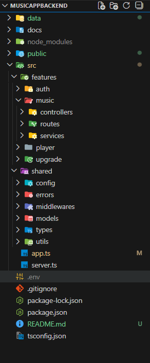

# 🎵 Music App – Backend API

Backend REST API for a full-stack music streaming application.  
This service handles authentication, music data orchestration, user interactions (favorites & history), and a **Premium subscription flow powered by Stripe**.

This project was designed as a **portfolio-grade application**, prioritizing scalability, maintainability, and real production patterns.

Developed over **~40 hours** of focused, tracked work, covering architecture, authentication, API integrations, payments, and deployment.
---

## 🌐 Live API

**Backend URL:**  
[Deployed Render Backend](https://musicappbackend-ccph.onrender.com/)

> ⚠️ This backend is hosted on Render (Free plan).  
> Cold starts may take a few seconds on the first request.

---

## 🧠 Features

- 🔐 JWT-based authentication (Register / Login / Current user)
- 🎶 Music data aggregation (artists, albums, playlists, tracks, genres)
- 🔍 Search endpoint with real-time support
- ❤️ User favorites management
- 🕒 Listening history tracking
- 💳 Premium subscription with Stripe Checkout
- 🔔 Stripe Webhooks to persist premium status
- 🧊 Cold-start friendly landing page for Render

---

## 🛠️ Tech Stack

| Category        | Technology |
|-----------------|------------|
| Runtime         | Node.js |
| Framework       | Express |
| Language        | TypeScript |
| Payments        | Stripe API |
| Authentication  | JWT |
| Middleware      | CORS |
| Deployment      | Render |

---

## 🧩 Architecture & Project Structure

The backend follows a **feature-based architecture**, where each domain encapsulates its own routes, controllers, and business logic.

<p align="center">
  
</p>

---

## 📌 Implementation Highlights

- Feature-based modular routing
- Centralized error handling with a custom `AppError`
- Protected routes using authentication middleware
- Stripe Checkout session creation
- Secure webhook handling using raw body parsing
- Clear separation between API responsibilities

---

## 🔐 Authentication Endpoints

- `GET /auth/me` is a **protected route**
- A valid **JWT** must be sent in the `Authorization` header

---

## 🎶 Music API Endpoints

```http
GET /api/music/home/artists
GET /api/music/home/genres
GET /api/music/home/playlists

GET /api/music/artist/:id
GET /api/music/artist/:id/albums

GET /api/music/playlist/:id
GET /api/music/:genreId/artists

GET /api/music/track/:id
GET /api/music/album/:id

GET /api/music/search
```
These endpoints are consumed by the frontend to build:

- Home view

- Artist & album views

- Playlist view

- Genre-based browsing

- Global search dropdown

▶️ Player Endpoints
-------------------

> 🔒 **All player routes require authentication**

`   POST /api/player/favorite  POST /api/player/history   `

### Features

*   Toggle favorite tracks
    
*   Persist listening history per user
    

💎 Premium Upgrade – Stripe Integration
---------------------------------------

### 🔁 Premium Flow

1.  User clicks **Upgrade** on the frontend
    
2.  Backend creates a **Stripe Checkout Session**
    
3.  User completes payment using a **mock card**
    
4.  Stripe sends a **webhook event**
    
5.  Backend updates the user as isPremium = true
    
6.  Frontend reflects premium status (**badge**, gated features)
    

### 🧾 Create Checkout Session

`   POST /api/upgrade/create-checkout-session   `

*   🔒 **Protected route**
    
*   Creates a Stripe Checkout session
    

### 📄 Retrieve Checkout Session

`   GET /api/upgrade/session/:sessionId   `

*   Used to confirm payment status after redirect
    

### 🔔 Stripe Webhook

`   POST /api/upgrade/webhook   `

*   Receives Stripe events
    
*   Uses express.raw() for signature verification
    
*   Updates user premium status securely
    

🧪 Dev Experience & Best Practices
----------------------------------

*   Type-safe controllers with **TypeScript**
    
*   Centralized error middleware
    
*   Clean separation of concerns
    
*   Environment-based configuration
    
*   Ready for scaling or feature expansion
  
## ⏲️ Time Tracking

- Total tracked development time: **39h 57m**
- Sessions logged individually across architecture, frontend, backend, and integrations
    

🧊 Cold Start Handling
----------------------

Since **Render Free tier** puts services to sleep:

*   A custom index.html is served at /
    
*   Informs users about cold starts
    
*   Redirects safely to the frontend once the backend wakes up
  
----

## 📬 Contact

**Facundo Robert**  
Frontend / Full Stack Developer  

- 💼 LinkedIn: [Facundo Robert](https://www.linkedin.com/in/robertfacundodev/) 
- 💻 Portfolio: [My Portfolio](https://facundorobert.vercel.app/)   
- 📧 Email: robertf.coder@gmail.com 

---

⭐ If you like this project or found it useful, feel free to star the repo!